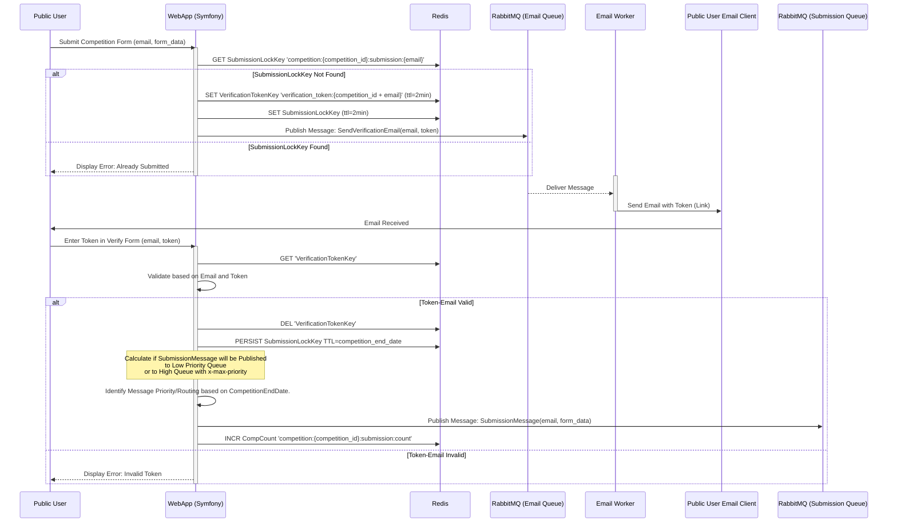
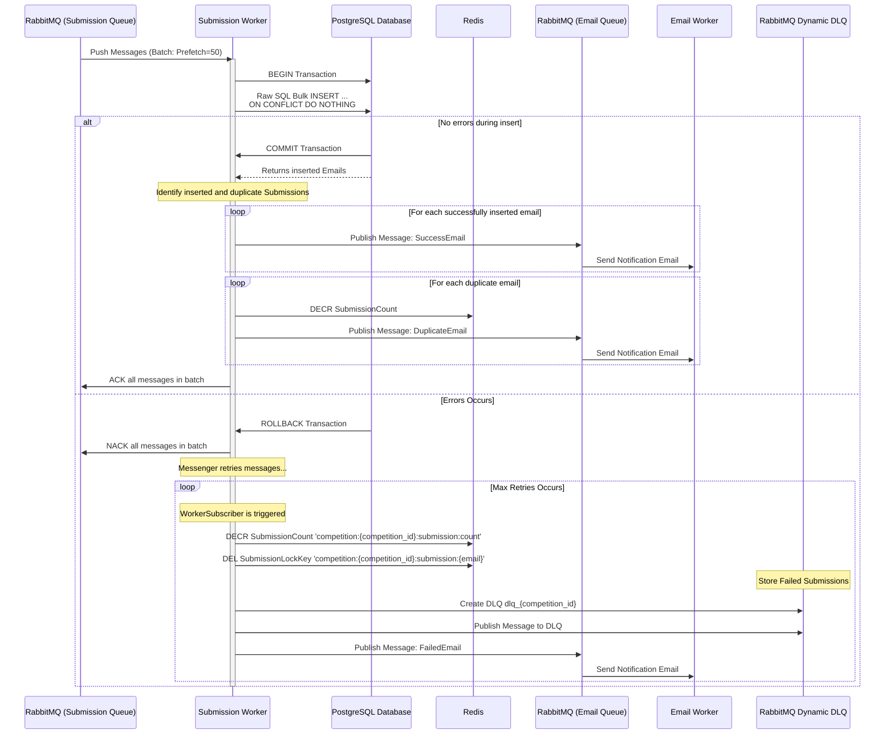
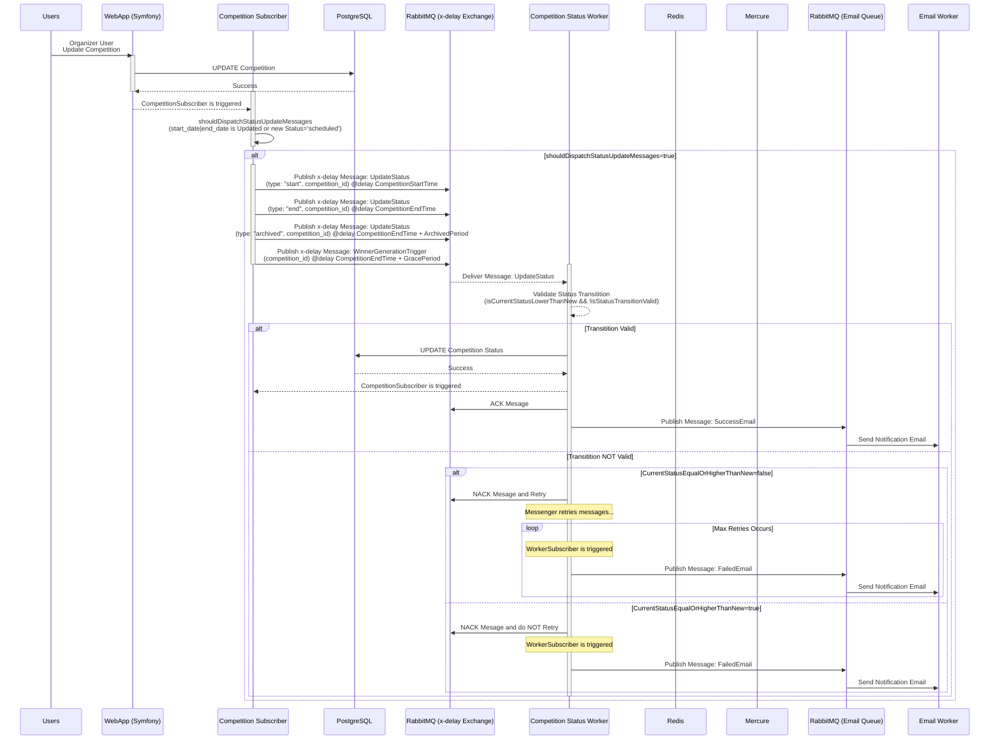
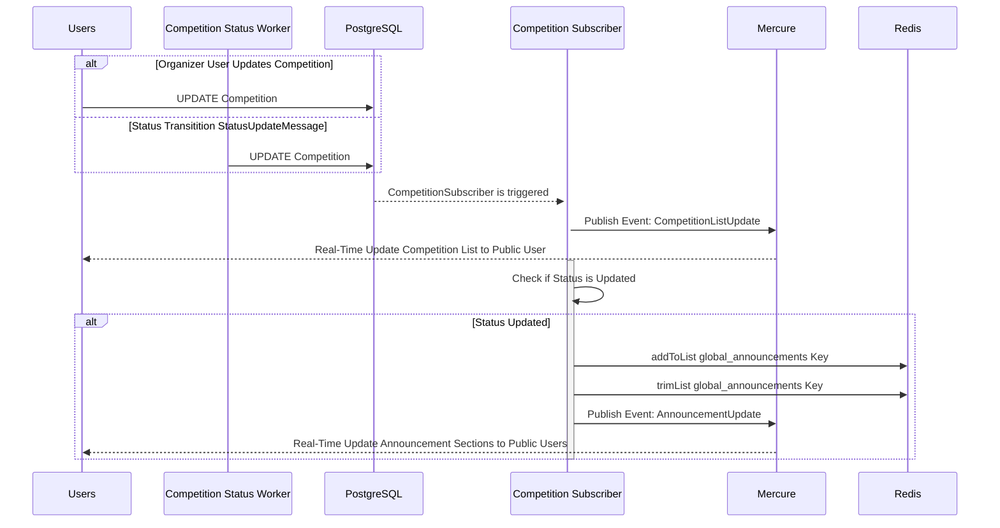
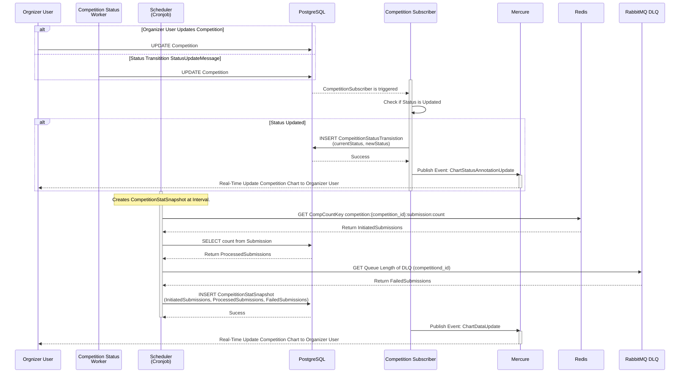
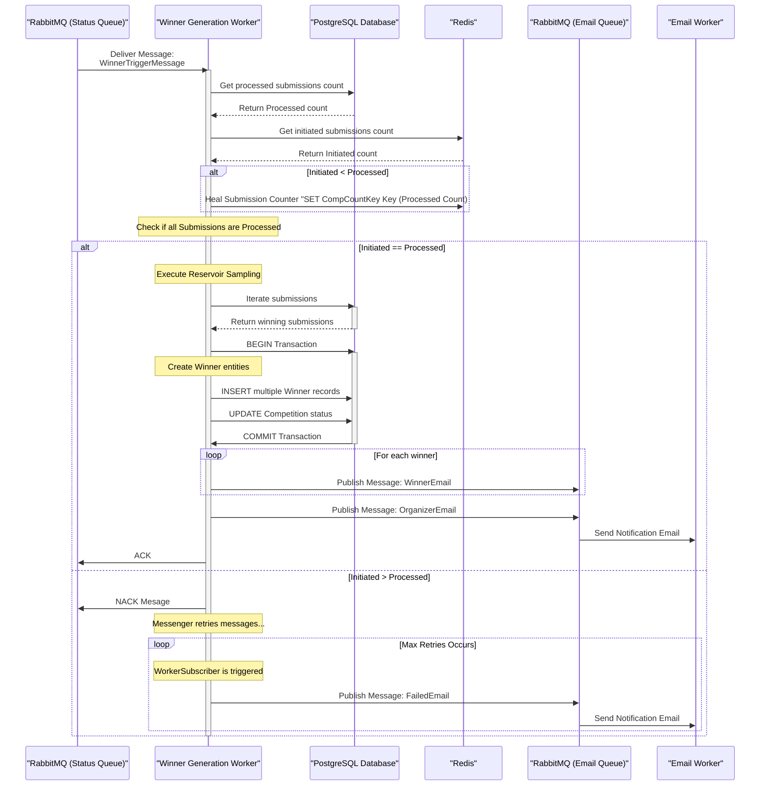

#  4.1 Ροή Υποβολής και Επαλήθευσης Χρήστη
## Sequence Diagram

# 4.2 Επεξεργασία Υποβολών (Batch Process, Bulk Insert, DLQ)
## Sequence Diagram

# 4.3 Αυτοματοποίηση Κατάστασης Διαγωνισμών
## Sequence

# 4.4 Real Time Ενημερώσεις Competition και Announcements

## Sequence

# 4.5 Real Time Ενημερώσεις Chart & Καταγραφή Στατιστικών Διαγωνσμού.
## Sequence

# 4.6 Δημιουργία Τυχαίων Νικητών
## Sequence
